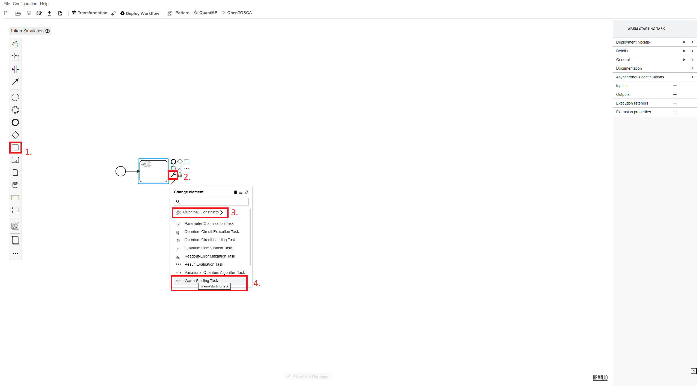
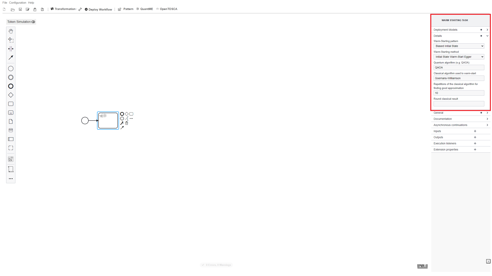
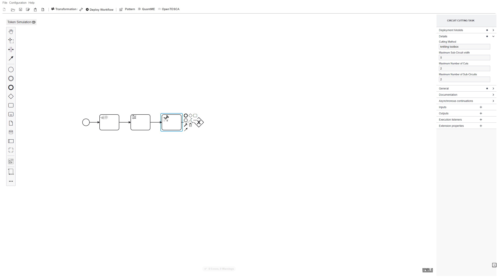
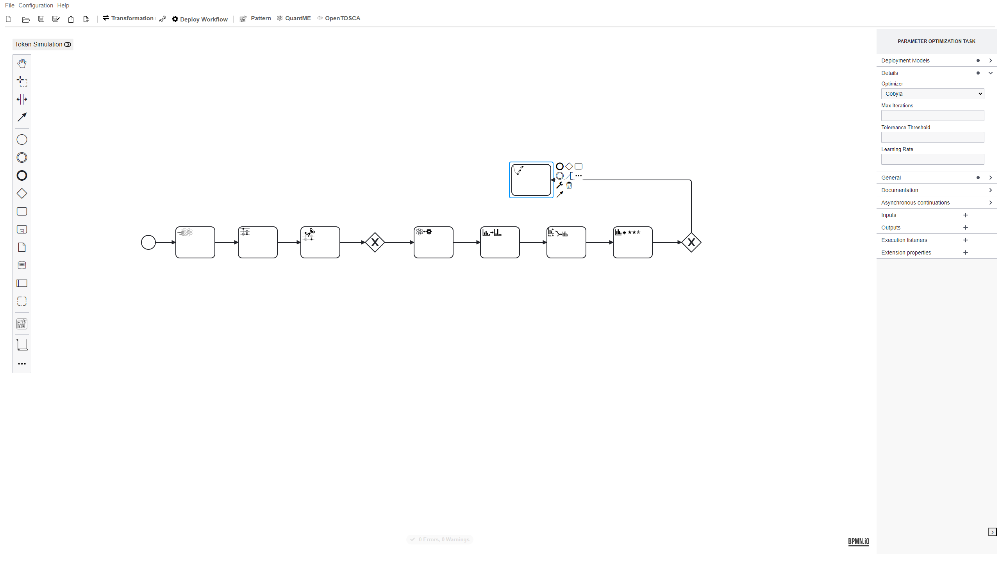
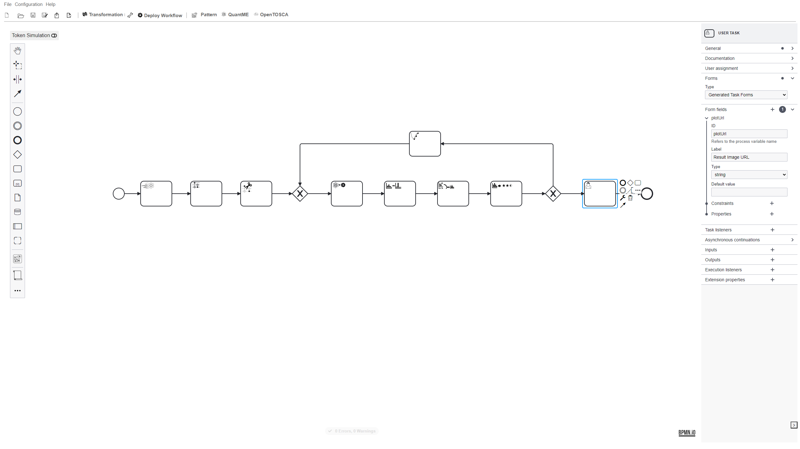

# Hands-On Session

In the following, we will guide you through all the steps required to model, deploy, and execute a hybrid quantum application using workflows.
In the first part of the tutorial, a quantum workflow is modeled manually by attendees.
Afterwards, the same workflow is automatically generated based on a set of selected patterns.

The use case utilizes the following tools:

* [Pattern Atlas](https://github.com/PatternAtlas): A graphical tool for authoring and visualizing patterns and pattern languages.
* [Process View Plugin](https://github.com/UST-QuAntiL/camunda-process-view-plugins): A plugin for the Camunda engine to visualize process views.
* [OpenTOSCA Container](https://github.com/OpenTOSCA/container): A TOSCA-compliant deployment system.
* [Quantum Workflow Modeler](https://github.com/PlanQK/workflow-modeler): A graphical BPMN modeler to define, transform, and deploy quantum workflows.
* [Quokka](https://github.com/UST-QuAntiL/Quokka): A microservice ecosystem enabling a service-based execution of quantum algorithms.
* [Winery](https://github.com/OpenTOSCA/winery): A web-based modeler for TOSCA-based deployment models, which can be attached to activities of quantum workflows to enable their automated deployment in the target environment.

## Setup

**In case you participate in the tutorial on-site and use one of the provided virtual machines, move to [Part 1](#quantum-workflow-modeler) and use the provided IP to replace the placeholder $IP.**

The code required for the hands-on session is available [here](https://github.com/UST-QuAntiL/QuantME-UseCases/tree/master/2024-icwe-tutorial).

On Windows, you have to activate long paths for Git to enable cloning and pushing to this repository.
Thus, execute the following command:

```
git config --system core.longpaths true
```

Afterwards, clone the repository and navigate to the ``2024-icwe-tutorial`` folder:

```
git clone https://github.com/UST-QuAntiL/QuantME-UseCases.git
cd QuantME-UseCases/2024-icwe-tutorial
```

All components are available via Docker.
Therefore, these components can be started using the Docker-Compose file available [here](https://github.com/UST-QuAntiL/QuantME-UseCases/tree/master/2024-icwe-tutorial/docker):

1. Update the [.env](https://github.com/UST-QuAntiL/QuantME-UseCases/tree/master/2024-icwe-tutorial/docker/.env) file with your settings: 
  * ``PUBLIC_HOSTNAME``: Enter the hostname/IP address of your Docker engine. Do *not* use ``localhost``.
  * ``IBM_ACCESS_TOKEN``: Enter your IBMQ token, which can be retrieved [here](https://quantum.ibm.com/). The token can also be left empty, but then the views described below only display a reduced set of data.

2. Run the Docker-Compose file:
```
cd docker
docker-compose pull
docker-compose up --build
```

3. Wait until all containers are up and running. This may take some minutes.

## Quantum Workflow Modeler

Open the quantum workflow modeler using the following URL: http://$IP:8080

Afterwards, the following screen should be displayed:


Familiarize yourself with the workflow modeler by dragging and dropping elements from the palette on the right into the modeling pane.

If you are not familiar with BPMN, have a look at the [Camunda introduction](https://camunda.com/bpmn/).

## Part 1: QAOA for MaxCut

In the first part of the hands-on session, you will model and execute a quantum workflow orchestrating the [Quantum Approximate Optimization Algorithm (QAOA)](https://arxiv.org/pdf/1411.4028.pdf) to solve the Maximum Cut (MaxCut) problem.
To model the quantum workflow, the [Quantum Modeling Extension (QuantME)](https://www.iaas.uni-stuttgart.de/publications/Weder2020_QuantumWorkflows.pdf) is used.

First, add a Warm-Starting Task after the initial Start Event.
Warm-starting is used to approximate a solution that is incorporated into the quantum circuit to facilitate the search for the optimal solution.
Select the Task icon in the palette (1), drag it into the pane, click on the wrench symbol (2), then first select the QuantME Constructs category, and afterwards QuantME Tasks in the drop-down menu (3).
Finally, click on Warm-Starting Task within the QuantME Tasks category.



Configure the Warm-Starting Task using the values shown below.
Thereby, ``Biased Initial State`` is selected as Warm-Starting pattern and ``Initial State Warm-Start Egger`` as Warm-Starting method.
Furthermore, we will use QAOA to solve the MaxCut problem, thus, select ``QAOA`` as the quantum algorithm to warm-start.
Finally, utilize the ``Goemans-Williamson`` algorithm to calculate the initial state to use, as well as ``10`` repetitions to use for the approximation.



Next, add a second task of type Quantum Circuit Loading Task to load to parameterized QAOA circuit that is later executed in the variational loop.
The functionality to generate a corresponding quantum circuit is provided by Quokka, therefore, configure the task using ``quokka/maxcut`` as URL.
Furthermore, connect both tasks with the start event using sequence flow.


Due to today's restricted quantum computers, the quantum circuit should be [cut into multiple smaller sub-circuits](https://arxiv.org/pdf/2302.01792), thus, reducing the impact of errors, as well as the limited number of qubits.
Add a Circuit Cutting Task, which is also available within the QuantME Tasks category.
Configure the Circuit Cutting Task to use the Cutting Method ``knitting toolbox``, utilizing the implementation provided by the [Circuit Knitting Toolbox](https://qiskit-extensions.github.io/circuit-knitting-toolbox/).
Furthermore, set the Maximum Sub-Circuit width to ``5``, the Maximum Number of Cuts to ``2``, and the Maximum Number of Sub-Circuits to ``2``.
Finally, add an Exclusive Gateway to later join the sequence flow of the optimization loop.



Next, add a task of type Quantum Circuit Execution Task to execute the loaded quantum circuit on a quantum computer.
For this example, we configure the task to use ``ibm`` as the quantum hardware provider and the ``aer_qasm_simulator`` as QPU.
The aer_qasm_simulator is a simulator that can be executed locally to avoid queuing times.
Furthermore, the number of shots, i.e., the number of executions, is set to ``2000``, and it is specified that the circuit to execute was implemented using ``openqasm``.


To reduce the impact of readout errors, add a Readout Error Mitigation Task and configure it as follows:

* Provider: ``ibm``
* QPU: ``aer_qasm_simulator``
* Mitigation Method: ``Matrix Inversion``
* Calibration Matrix Generation Method: ``Full Matrix``


After the mitigation, the results of the different sub-circuit executions are combined using a Cutting Result Combination Task to receive the overall result.
Thereby, the same Cutting Method must be used, i.e., ``knitting toolbox``.


To evaluate the quality of the results, add a Result Evaluation Task and configure it as follows:

* Objective Function: ``Expectation Value``
* Cost function to use: ``maxcut``

Additionally, add another Exclusive Gateway to enter the next iteration of the optimization loop if required.


If another iteration is required, the parameters are optimized using a Parameter Optimization Task.
Configure the task to utilize ``Cobyla`` as an Optimizer.



Connect the Optimizer Task to the first Exclusive Gateway.
Afterwards, add the following expression to the sequence flow between the second Exclusive Gateway and the Optimizer Task as shown below:
``${ execution.getVariable('converged')== null || execution.getVariable('converged') == 'false'}``


Finally, add a User Task and connect the second Exclusive Gateway to it.
Furthermore, use the following condition: ``${ execution.getVariable('converged')!= null && execution.getVariable('converged') == 'true'}``
The Result Evaluation Task generates an image to visualize the identified MaxCut.
Thus, the User Task has to be configured to enable analyzing this image.
Hence, use a form of type Generated Task Forms and add a form field to display the URL of the result image as shown below:



TODO

## Part 2: Pattern-based Generation of Quantum Workflows

TODO